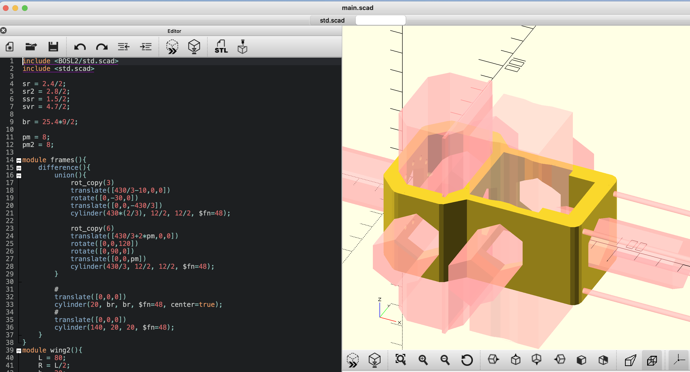

## mono copter

* 自作モノコプターを作成した時のメモ。

## イメージ

* 動画：
  * [フラフラ](https://youtu.be/5Qog1V-RosM)
  * [フラフラ2](https://youtu.be/LrC2EZjt1GY)
  * [墜落](https://youtu.be/phDMzeqYPqU)

## 材料

* raspberry pi pico 2040
  * 秋月：ＲＰ２０４０マイコンボードキット
  * Type-Cなのがお気に入り
* IMU
  * 秋月：ＢＭＸ０５５使用９軸センサーモジュール
  * 注意：センサーヒュージョンでクォータニオンまで計算してくれるモジュールもあります。
  * 今回は、自力で実装してみたかったので、生データ出力のみのモジュールを使った。
* プロポ（ヘリ用）・レシーバーセット(S.BUSプロトコル使用)
  * フタバ T10J
* カーボンパイプ
* リポバッテリー
  * 4セル
* モーター
  * デュアルスカイ ECO 2820C-V2 アウトランナーブラシレスモーター (800RPM/540W)
  * 最初は推力ギリギリのモーター使ってたけど、余裕のあるモーターの方が熱を持ちにくくてなんとなく良い気がする。
* ESC
  * HOBBYWING SKYWALKER 50A V2 ブラシレスESC
  * モーターへの大電流をコントロールするやつです
* サーボ(3個)
  * マイクロサーボ　ＭＧ９２Ｂ
  * メタルギアがいい感じ
  * それでも墜落した時に、負荷がかかりすぎて、ギアが割れて壊れた。
  * もう少し、馬力はなくても瞬発力がある方が良さそう。
* サーボケーブル延長
* プロペラ
  * [APC 9x8E 電動用３枚ペラ](https://www.little-bellanca.com/SHOP/21108.html)
  * プロペラの回転数や電流と推力の関係のデータシート
    * [公式パフォーマンスデータ](https://www.apcprop.com/technical-information/performance-data/)
    * 今回のプロペラは→PER3_9x8E-3.dat
* バネ
  * 足のバンパー用
* ねじ
  * とにかく軽くしたかったのでチタン製!
  * チタンB0ナベタッピング　M3X10
  * 他にも小さいねじを少々…

## 3D data

* パーツは、OpenSCADを使って設計し、3Dプリントしました
  * プログラミングみたいに設計できる！
* コード散らかってます…

